# 🚀 AWS 3-Tier Architecture Project

## 📖 Overview
This project demonstrates a production-style AWS architecture using:
- VPC with public and private subnets
- Application Load Balancer (ALB)
- EC2 instances (Windows) in private subnet
- RDS MySQL database in private subnet
- NAT Gateway for outbound internet access
- Bastion Host for secure access

---

## 🧱 Architecture

---

## 🔄 Traffic Flow

User → ALB → Private EC2 → RDS Database

---

## 🛠️ Technologies Used

- AWS VPC
- EC2 (Windows Server)
- Application Load Balancer
- RDS (MySQL)
- NAT Gateway
- Security Groups

---

## 🔐 Security

- EC2 instances are in private subnets
- RDS is not publicly accessible
- Bastion host used for secure RDP access
- Security group-based communication

---

## 🧪 Testing

- Load balancing tested across multiple EC2 instances
- Failover tested by stopping one EC2 instance
- Database connectivity verified using MySQL CLI

---

## ⚠️ Note

All AWS resources have been stopped/terminated to avoid billing.  
This repository contains documentation and proof of implementation.

---

## 👨‍💻 Author

Meghraj Rathod